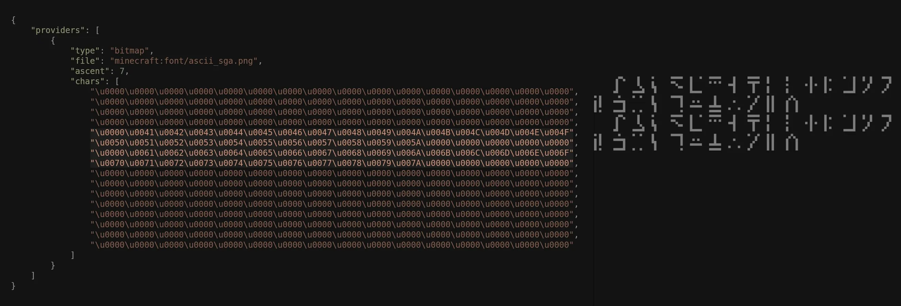

# What is this?

Minecraft's Java Edition uses a somewhat unique font rendering system. Unlike traditional applications that might rely on system fonts, Minecraft bundles its own set of font textures and mechanisms to display text within the game world, menus, and chat. This page will briefly explain this system and how Minecraft Glyph Database (MGD) is built upon it. The information presented here is sourced from Minecraft's internal files and the [Minecraft Wiki](https://minecraft.wiki/w/Font).

## How do fonts work?

Directly quoting the Minecraft Wiki, "A font is constructed from a list of providers, sources that provide characters to use. Different providers use different formats and methods of constructing characters." These aforementioned "sources" are JSON files which reside in the `/assets/minecraft/font` subfolder of any Minecraft Version's JAR file. One of these providers in particular, the "**Bitmap provider**," references PNG files that contain glyphs for said font in a grid-like arrangement—i.e., a bitmap. This provider also consists of a list of glyphs that correspond one-to-one with the grid positions in the texture bitmap, matching the layout both horizontally and vertically.

The `\u0000` character represent [NULL in Unicode](https://www.unicode.org/charts/PDF/U0000.pdf), effectively used as padding in this instance. In the images above, you can see how the characters match up with the glyphs on the texture, which is key as this allows us to extrapolate glyph-character pairs. Specifically, we leverage the ordered list of characters in the provider and the structured nature of the bitmap. For each character defined in the provider, its position within that list directly corresponds to a specific cell in the bitmap's grid. Knowing the bitmap's overall dimensions and the implicitly defined size of each character cell (derived from the width, height, and a calculation based on the total number of characters and texture size), we can precisely calculate the pixel coordinates and the bounding box for that glyph. This enables us to 'cut out' or extract the exact pixel data for a given glyph from its specific region within the texture's boundaries.

## What fonts are included?

By default, Java Edition has four fonts, but only three are in this database (marked with an asterisk):

  * **default**\*
  * **alt**\*
  * **uniform**
  * **illageralt**\*

The `uniform` font is the exception because it acts as a fallback, referencing a ZIP file containing a copy of GNU Unifont, which isn't unique to Minecraft. The *included* aforementioned fonts reference a total of five bitmap textures:

| Filename                          | Font         |
| :-------------------------------- | :----------- |
| `accented.png`                    | `default`    |
| `nonlatin_european.png`           | `default`    |
| `ascii.png`                       | `default`    |
| `ascii_sga.png`                   | `alt`        |
| `asciilager.png`                  | `illageralt` |