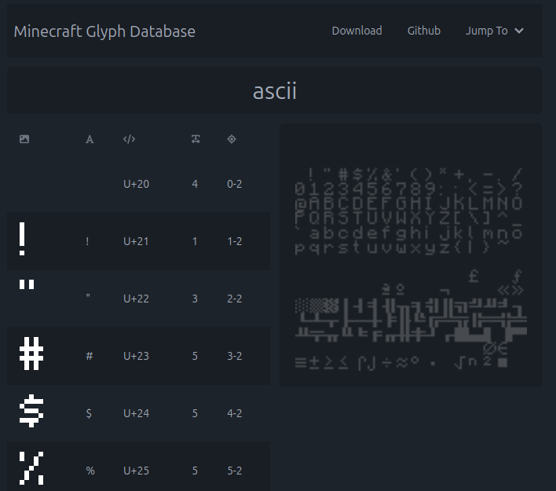

<h1 align="center">
Minecraft Glyph Database (MGD)
<br>
</h1>

<h4 align="center"> A comprehensive, searchable list of all default glyphs in Java-Minecraft's font textures. 

</h4>


<p align="center">
  <a href="#what-fonts-are-included">What fonts are included</a> · <a href="#self-hosting">Self Hosting</a> · <a href="#disclaimer">Disclaimer</a> · <a href="#license">License</a>
</p>

<div align="center">

</div>

## What fonts are included
The [Minecraft Wiki](https://minecraft.wiki/w/Font#Java_Edition) contains a excelent overview of Minecraft's font system, but I'll describe it here briefly to give you an idea of what is going on behind the scenes.

By default, Java Edition includes four fonts, but only three are included in the database (marked with a *):

* default*
* alt*
* uniform
* illageralt*

All fonts reference files which contain the textures required for that specific font, usually PNG files. In these, you'll find a grid-like arrangement of glyphs, used in combination with a [provider](https://minecraft.wiki/w/Font#Providers) in order to map a given glyph to a character, which is how the database extrapolate glyph-character pairs. The simply reason uniform is not included is because it acts as fallback, referencing a ZIP file containing a copy of GNU Unifont, which is not unique to Minecraft.

The aforementioned fonts reference a total of five files in combination:
- accented.png (default)
- nonlatin_european.png (default)
- ascii.png`(default)
- ascii_sga.png (alt)
- asciilager.png (illageralt)

*These are the glyphs displayed in the database*.

## Self Hosting

> **Note:** [Node.js](https://nodejs.org/en) is required to run this project.

The project is divided into two main parts:

1. **Generator** - A JSON compiler.
2. **Webpage** - The GUI/Frontend.

To set up the webpage, you must first complete the steps in the [Generator](#generator) section, followed by the [Webpage](#webpage) section.

### Generator

The generator creates a JSON file containing:

- Glyph textures encoded in base64
- Glyph character representations
- Unicode character representations
- Glyph widths
- The bitmap where the given glyph is found
- The position of the glyph within the bitmap

#### Steps

1. Navigate to the `generator` folder and install the required packages:
   ```sh
   npm i
   ```
2. You must provide the necessary Minecraft asset files yourself due to copyright restrictions. These files are extracted from Minecraft's source code when running `generator.js`, specifying the path to the Minecraft version JAR file:
   ```sh
   node .\generator.js --path C:\Users\YourUsername\AppData\Roaming\.minecraft\versions\1.21\1.21.jar --name glyphs
   ```

    This command generates a JSON file called `glyphs.json` inside the `dist` folder. You can change the output file name using the `--name` argument.

### Webpage

The webpage allows users to interact with and view the glyphs.

#### Steps

1. Navigate to the `webpage` folder and install the required packages:
   ```sh
   npm i
   ```
2. Move the generated JSON file from the `dist` folder inside the `generator` directory into the `public` folder inside the `webpage` directory.
3. In the `.env` file, set the `VITE_FILE` variable to the name of your JSON file (default is `glyphs.json`).
4. Build the webpage:
   ```sh
   npm run build
   ```
5. To preview the webpage, run:
   ```sh
   npm run preview
   ```
   You can also upload the built files to your own static host.
6. (Optional) Use `npm run dev` to start the development server for local testing.


## Disclaimer

While the compiled webpage includes copyrighted textures, the intention of this project is purely educational. The project:

1. Was created for educational purposes.
2. Is not monetized.
3. Does not negatively impact Minecraft's trademark.

However, if requested, the webpage will be taken down to comply with copyright laws.

**Note:** This project is not affiliated with or endorsed by Mojang and Microsoft.

## License

This project is licensed under the MIT License.