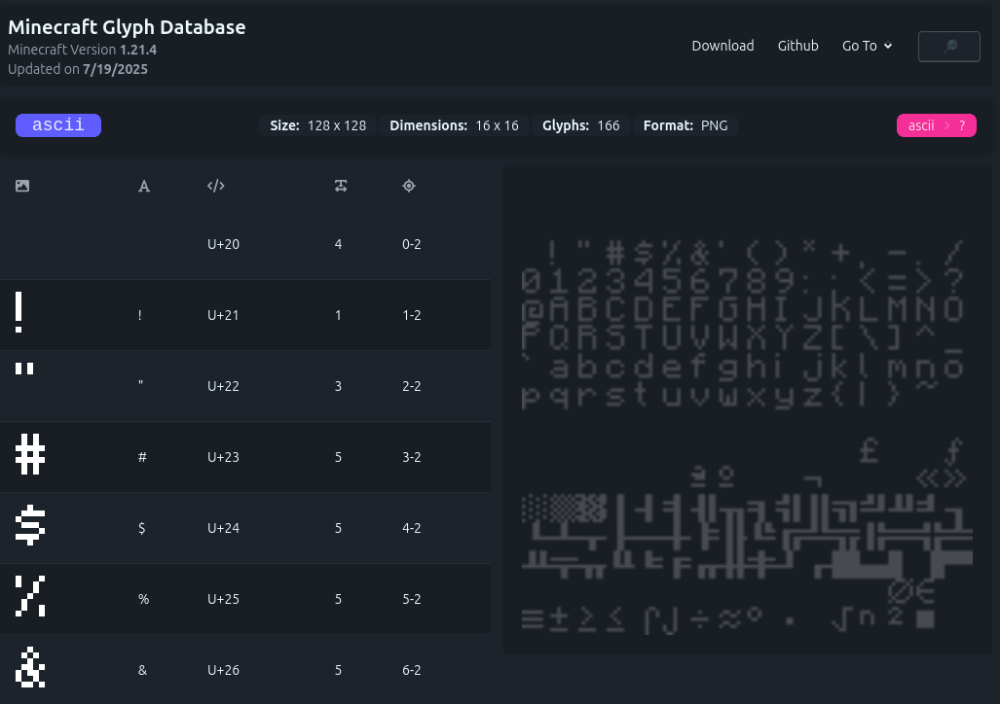

<h1 align="center">
Minecraft Glyph Database (MGD)
<br>
</h1>

<h4 align="center"> A comprehensive, searchable list of all default glyphs in Java-Minecraft's font textures. 

</h4>


<p align="center">
  <a href="#about-the-project">About the Project</a> · <a href="#self-hosting">Self Hosting</a> · <a href="#disclaimer">Disclaimer</a> · <a href="#license">License</a>
</p>

<div align="center">

</div>

## About the Project

The Minecraft Glyph Database (MGD) provides a comprehensive and searchable collection of all default glyphs found within Java Edition of Minecraft's font textures. This project aims to offer an easy way to explore and understand the intricate font system used in the game. It was initially built for [Text2Book](https://github.com/TheWilley/Text2Book).

You can read more about the project in the [ABOUT document](ABOUT.md).


## Self-Hosting
> [!NOTE] [Node.js](https://nodejs.org/en) is required to run this project.

This project is divided into two main components: the **Generator** (a JSON compiler) and the **Webpage** (the GUI/Frontend).


To set up the webpage for self-hosting, you must first complete the steps outlined in the [Generator](https://www.google.com/search?q=%23generator) section, followed by the [Webpage](https://www.google.com/search?q=%23webpage) section.

### Generator

The generator script creates a `glyphs.json` file. This JSON file contains data for each glyph, including:

  * Base64 encoded glyph textures
  * Glyph character representations
  * Unicode character representations
  * Glyph widths
  * The bitmap file where the glyph is located
  * The position of the glyph within its bitmap

#### Generator Setup Steps

1.  Navigate to the `generator/src` folder in your terminal:
    ```bash
    cd generator/src
    ```
2.  Install the necessary Node.js packages:
    ```bash
    npm install
    ```
3.  You must provide the Minecraft version JAR file yourself due to copyright restrictions. This file contains the assets needed for glyph extraction. Run the `generator.js` script, specifying the path to your Minecraft JAR:
    ```bash
    node .\generator.js --path "C:\Users\YourUsername\AppData\Roaming\.minecraft\versions\1.21\1.21.jar"
    ```
    This command will generate a `glyphs.json` file inside the `dist` folder.

### Webpage

The webpage provides the interactive user interface for viewing and searching the generated glyphs.

#### Webpage Setup Steps

1.  Navigate to the `webpage` folder in your terminal:
    ```bash
    cd webpage
    ```
2.  Install the necessary Node.js packages:
    ```bash
    npm install
    ```
3.  Move the `glyphs.json` file you generated (from `generator/dist/`) into the `public` folder located within the `webpage` directory.
4.  Build the webpage for production:
    ```bash
    npm run build
    ```
5.  To preview the built webpage locally:
    ```bash
    npm run preview
    ```
    Alternatively, you can upload the contents of the `dist` folder (created by `npm run build`) to your preferred static web host.
    
## Disclaimer

While the compiled [GitHub Pages](https://pages.github.com/) webpage may include copyrighted textures, the sole intention of this project is educational. This project:

1.  Was created exclusively for educational purposes.
2.  Is not monetized in any way.
3.  Does not negatively impact Minecraft's trademark or brand.

However, should Mojang or Microsoft request its removal, the webpage will be taken down immediately to comply with copyright laws.

**Note:** This project is not affiliated with or endorsed by Mojang Studios or Microsoft Corporation.

## License

This project is licensed under the MIT License.